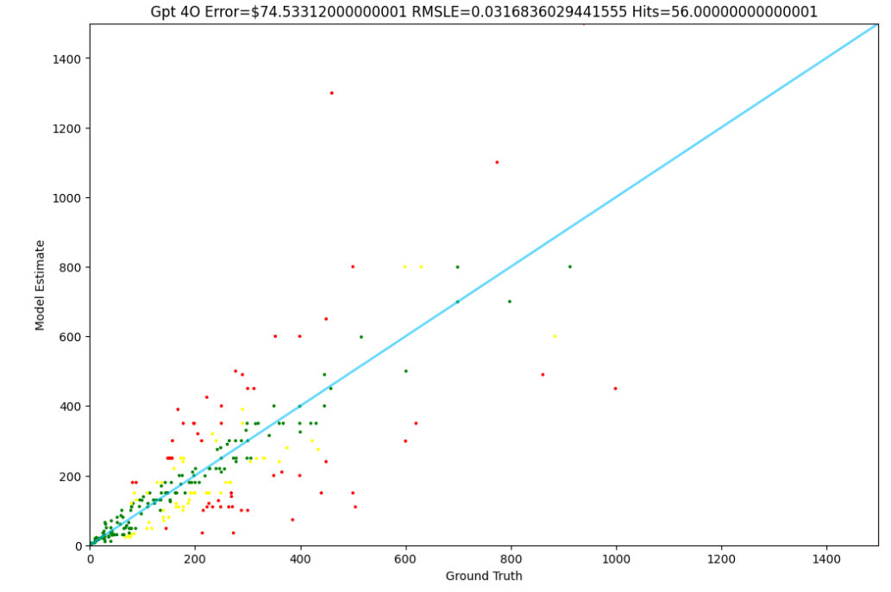
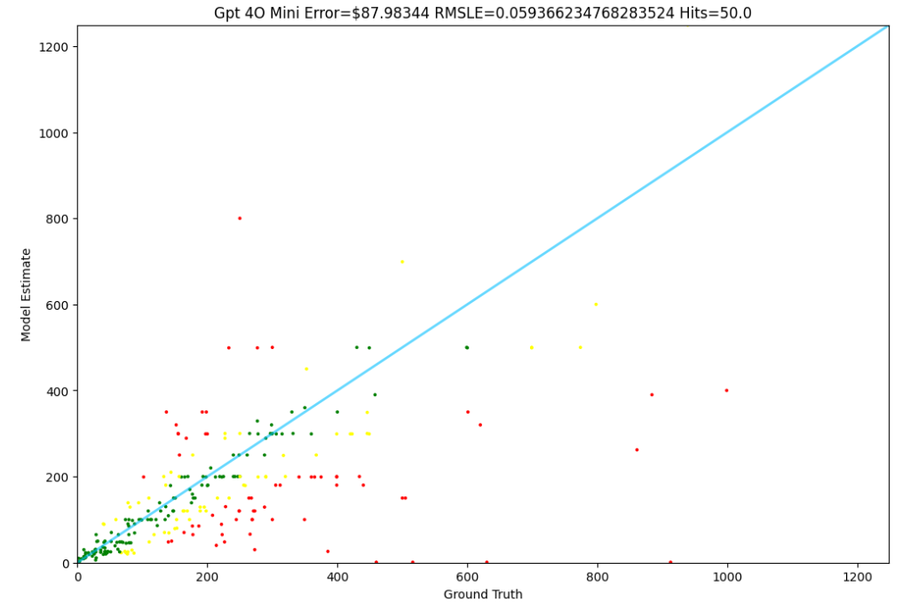
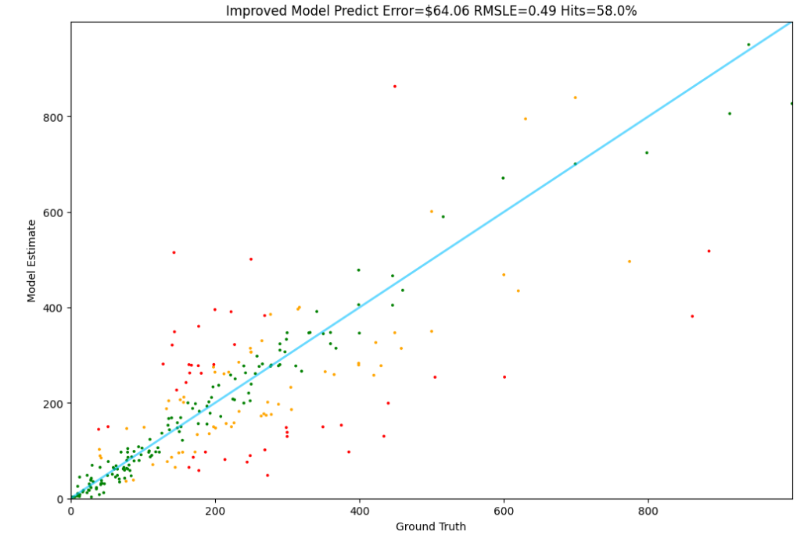

# Pricer

Pricer is a project that demonstrates fine-tuning a large language model (Meta-Llama 3.1-8B) using QLoRA techniques to predict item prices based on textual descriptions. The project leverages custom data processing, efficient LoRA-based fine-tuning, and evaluation scripts to produce a model that estimates prices from item details.
## AIM:
Fine-tune LLaMA 3.1 using QLoRA for accurate price prediction from textual product descriptions, outperforming frontier models like GPT-4o and GPT-4o Mini

## Results
### Comparison Table

| Model                     | Error  | RMSLE | Hits   |
|---------------------------|--------|-------|-------:|
| **GPT 4o**               | 74.53  | 0.0317| 56.0%  |
| **GPT 4o Mini**          | 87.98  | 0.0594| 50.0%  |
| **LLaMA 3.1** | 395.75 | 1.49  | 28.0%  |
| **Fine-Tuned LLaMA 3.1** | 64.06  | 0.49  | 58.0%  |

Below are the model performance results with visualizations.

  <table>
    <tr>
      <td align="center"><strong>GPT-4o</strong></td>
      <td align="center"><strong>GPT-4o Mini</strong></td>
    </tr>
    <tr>
      <td></td>
      <td></td>
    </tr>
    <tr>
      <td align="center"><strong>LLAMA-3.1 Without Fine-Tuning</strong></td>
      <td align="center"><strong>LLAMA-3.1 Fine-Tuned</strong></td>
    </tr>
    <tr>
      <td></td>
      <td></td>
    </tr>
  </table>

## Features

- **QLoRA Fine-Tuning:** Uses LoRA (Low-Rank Adaptation) to fine-tune the Meta-Llama 3.1-8B model efficiently.
- **Custom Data Processing:** Implements data cleaning and prompt generation for price prediction using custom modules.
- **Parallel Data Loading:** Uses parallel processing to load and preprocess data from the Amazon Reviews dataset.
- **Model Evaluation:** Provides testing scripts to assess model performance and visualize prediction errors.
- **HuggingFace Hub Integration:** Pushes the fine-tuned model to the HuggingFace Hub for easy sharing and deployment.
- **Weights & Biases Tracking (Optional):** Integrates with Weights & Biases for experiment tracking and monitoring.
  
## Project Structure

- **`qlora_llama_3_1_finetune.py`**  
  Main script for fine-tuning the Llama 3.1 model using QLoRA. It configures the training parameters, LoRA settings, and dataset details, and pushes the trained model to the HuggingFace Hub.  
  :contentReference[oaicite:0]{index=0}

- **`items.py`**  
  Contains the `Item` class, which is responsible for cleaning raw item data, generating prompts, and preparing text for training.  
  :contentReference[oaicite:1]{index=1}

- **`loaders.py`**  
  Implements the `ItemLoader` class that loads and processes the dataset in parallel from the "McAuley-Lab/Amazon-Reviews-2023" dataset.  
  :contentReference[oaicite:2]{index=2}

- **`tester.py`**  
  Provides tools for evaluating model performance. It includes functionality to compute errors, plot predictions versus ground truth, and generate reports based on the model’s estimates.  
  :contentReference[oaicite:3]{index=3}

- **Additional Notebooks:**  
  Other notebooks (e.g., for dataset generation, baseline models, testing unfine-tuned models) are included to support different stages of the development and evaluation pipeline.
